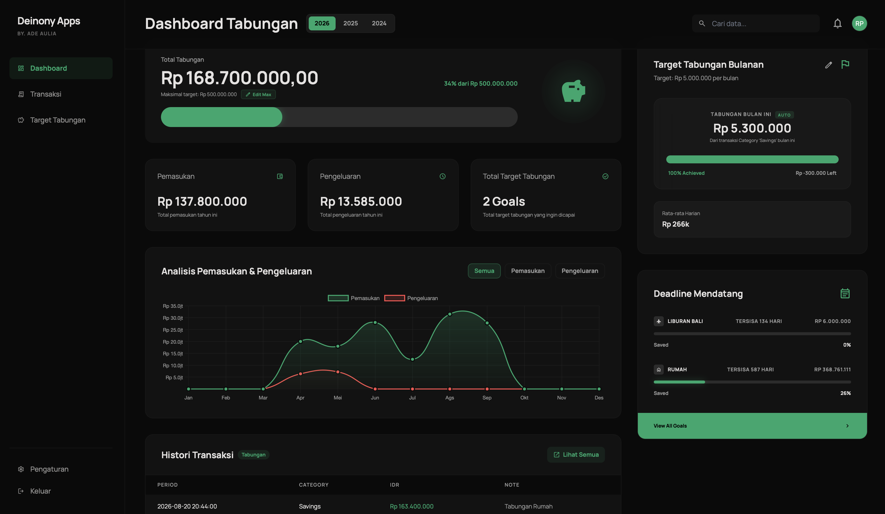
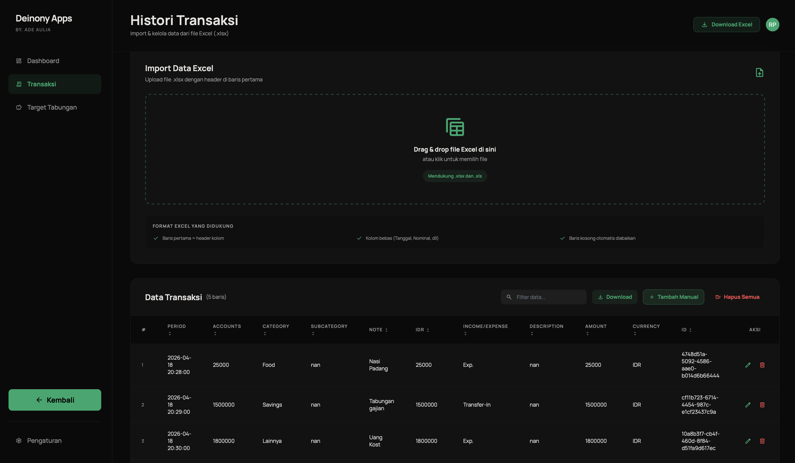
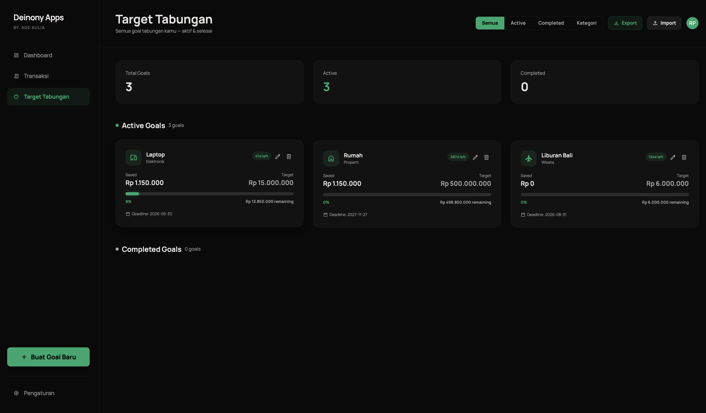

# Deiy Finance - Dashboard Tabungan 

Dashboard Tabungan adalah aplikasi manajemen keuangan pribadi berbasis web yang dibangun dengan Python (Flask). Dirancang untuk membantu kamu mencatat, memantau, dan menganalisis kondisi keuangan secara menyeluruh — mulai dari pemasukan dan pengeluaran harian, hingga progres target tabungan jangka panjang.
Semua data disimpan secara lokal dalam format .xlsx, sehingga tidak memerlukan koneksi internet maupun akun tambahan. Cukup jalankan di komputer sendiri dan data kamu tetap aman tersimpan.

---

## 📸 Tampilan Aplikasi

### Halaman Utama

### Data Transaksi

### Target Tabungan

---

## Instalasi dan Menjalankan Aplikasi

Ikuti langkah-langkah berikut untuk menjalankan sistem di lokal:

### 1️⃣ Install Dependencies
pip install -r requirements.txt

### 2️⃣ Jalankan Aplikasi
Windows: python app.py

Mac: python3 app.py

### 3️⃣ Akses di Browser
http://127.0.0.1:5000/

---

## Fitur Aplikasi 

**Dashboard**
- Card ringkasan: total tabungan, target tabungan, pemasukan, pengeluaran
- Edit target maksimal tabungan
- Edit & reset "sudah ditabung bulan ini"
- Grafik analitik pemasukan & pengeluaran bulanan per tahun
- Filter tahun dinamis (relatif dari data yang ada)
- Histori transaksi terbaru (pagination, maks 5 rows, hanya kategori Tabungan)
- Tombol filter mode grafik: pemasukan / pengeluaran / keduanya

**Transaksi**
- Tabel transaksi dengan pagination (maks 20 rows per halaman)
- Input transaksi baru: period, category, subcategory, description, IDR, accounts, amount, income/expense, note
- Auto-fill field accounts, IDR, amount saat input nominal
- Edit data transaksi (pop up dengan tombol simpan)
- Hapus data transaksi (per baris)
- Filter tampilan: pemasukan / pengeluaran
- Data tersimpan otomatis ke file .xlsx lokal

**Target Tabungan (Savings Goals)**
- Daftar goals dengan progress bar
- Buat goal baru: nama, target nominal, opsional persentase dari tabungan
- Edit goal yang sudah ada
- Hapus goal
- Data goals tersimpan di file .xlsx tersendiri dan dinamis

---

## Thanks for using this project—consider supporting & buy me a coffe 🙌🏻
- BCA: 6801800626 (Muhammad Aulia)
- BNI: 1561114751 (Muhammad Aulia)

---